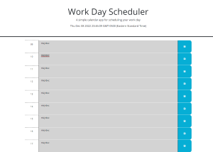

# Work Hourly Planner

## Description

Its a basic calendar oriented to an office hours schedule, it will feature the current date on top of the calendar, followed by a grid of text boxes in which the user can type strings that will be directed to local storage. Each block will have a diferent background color depending on its status, for example: if its a past hour box it will be colored gray.

## Link

[My Hourly planner](https://github.com/BelenGigante/hourly-schedule.git)

## Visuals

